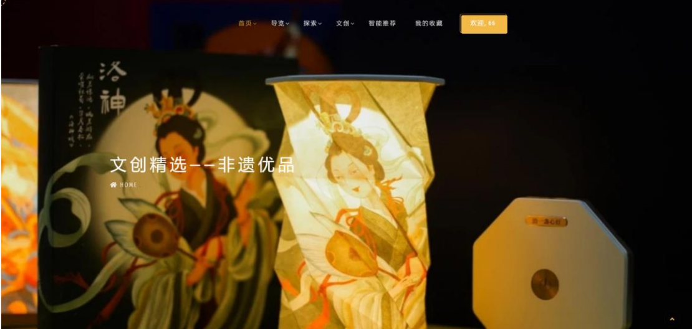
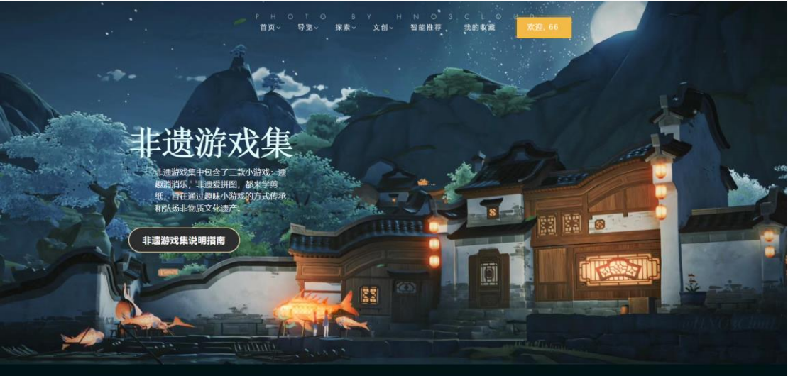
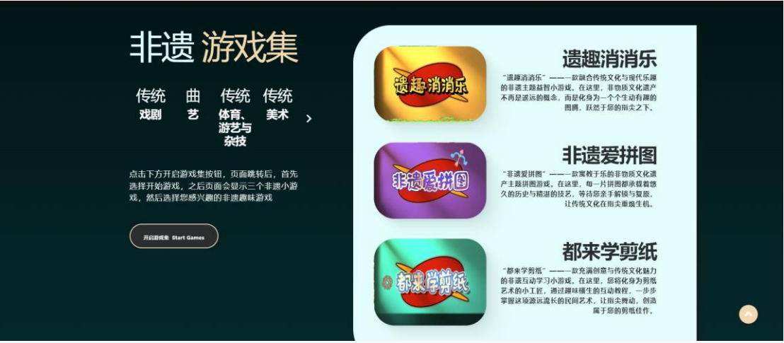
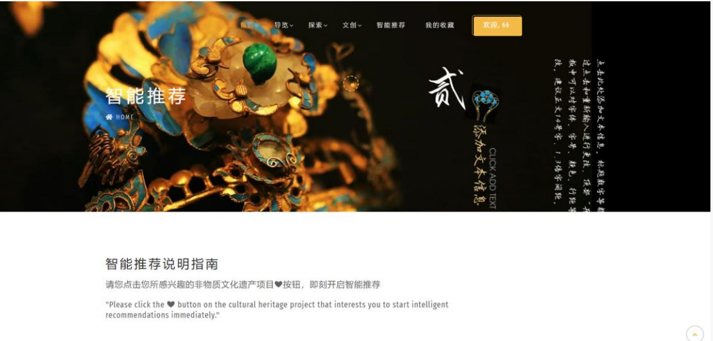
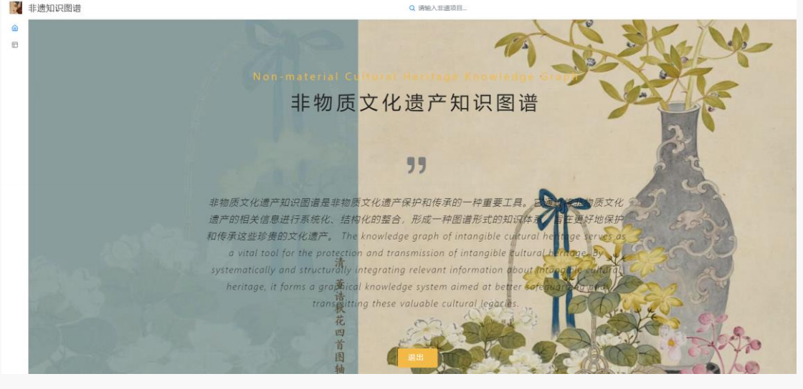
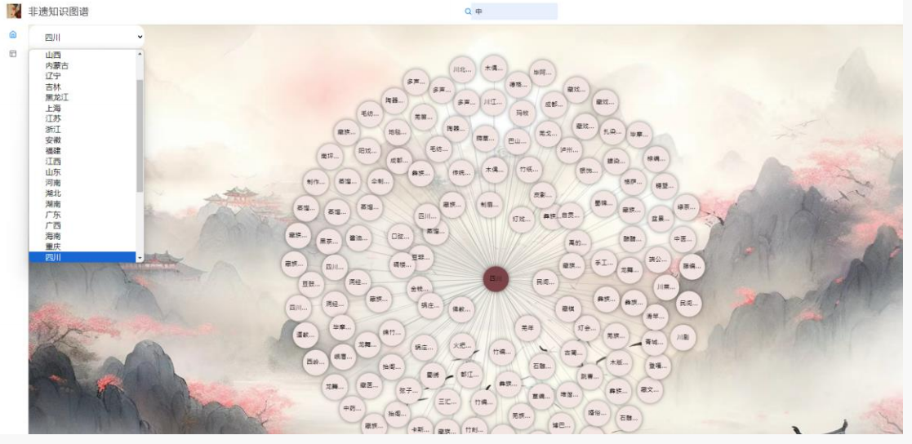
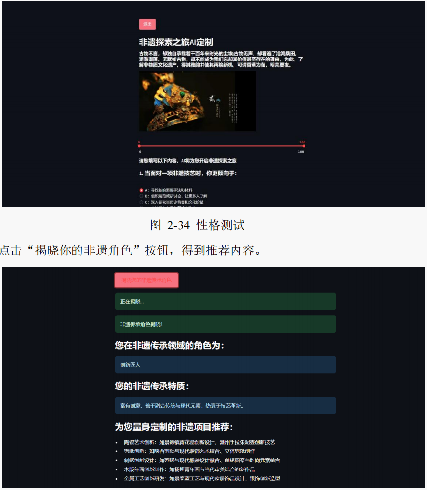
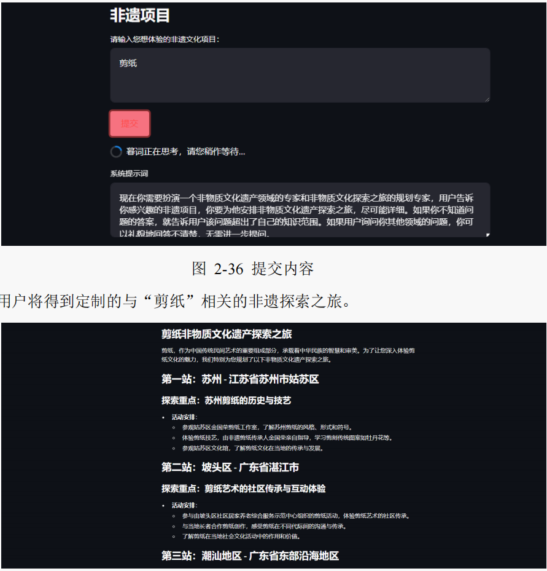

# “遗”见倾心——基于 Ren'Py 互动体验与知识图谱的个性化非物质文化遗产与文创推荐系统

> 简介：融合Ren'Py游戏引擎与大模型智能推荐的非遗文化平台，通过知识图谱构建与深度优先算法，为用户提供沉浸式非遗探索、文创购物与AI定制旅游的一站式体验。

## 项目背景
- 本项目融合 Ren'Py 引擎与知识图谱，构建“非遗档案—文创推荐—AI旅游定制”三位一体的文化体验系统。通过互动游戏增强参与感，基于知识图谱的智能推荐实现兴趣探索与精准匹配，结合大语言模型生成个性化非遗旅游路线，并整合 VR 数字展馆、非遗地图等功能，旨在打造可玩、可学、可购、可游的非遗文化平台。

## 系统展示
 提取码：3emx
[]
[]
[]
[]
[]
[]
[]
[]
[]
[]

